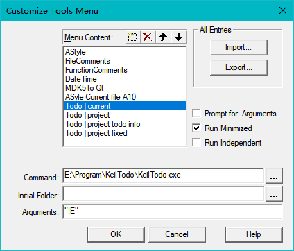
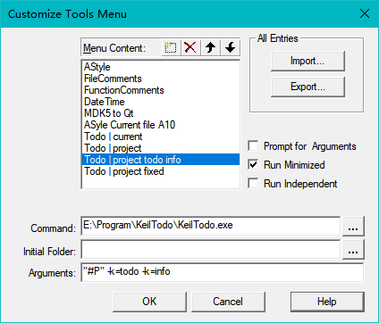
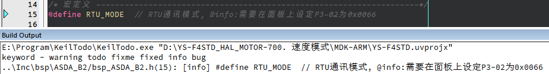
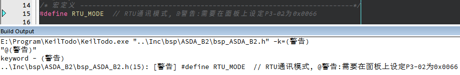

[Engilsh](readme.en.md)


## 编译环境

* Qt5.9 or later
* msvc2015 32-bit(64bit) or later/MinGW5.3 32bit(64bit) or later
* Qt Creator 5.0.3 or later

## 用法

```shell
Usage: Keiltodo [options] files
list keyword from Keil-MDKv5 project or source file

Options:
  -?, -h, --help  Displays this help.
  -v, --version   Displays version information.
  -k <keyword>    specific keyword to be scan
  -l              list all keyword in file
  -d              search hal/ll drivers

Arguments:
  files           Any number of text-files or one Keil-MDKv5 project file
```

-k <keyword>: 指定`keyword`,运行后只搜索该keyword,没有-k选项将搜索默认keyword

-l: 列出文件中所有关键字

-d: 搜索文件包括Drivers中的HAL/ll库文件.

files:指定搜索的文件,可以是多个文本文件,或者是Keil-MDK的工程文件(`*.uvpojx`),

#### 在命令提示符cmd中使用

* 使用默认的关键字

```shell
D:\Program\KeilTodo>keiltodo main.cpp
keyword - warning todo fixme fixed info bug
main.cpp(13): [todo] // @todo nothing todo

main.cpp(15): [bug] // @bug|ver1.5.1 修复bug,读取信号电平错误,版本号更新到1.5.1

main.cpp(17): [bug] // @bug @ver1.5.1 @bugfix 可同时使用多个关键字

main.cpp(17): [bug] // @bug @ver1.5.1 @bugfix 可同时使用多个关键字
```

* 使用特定的关键字

```sh
D:\Program\KeilTodo>keiltodo main.cpp -k=todo
keyword - todo
main.cpp(13): [todo] // @todo nothing todo
```

#### 在Keil-MDK中使用

新建外部工具,Arguments栏输入文件路径和关键字参数

勾选`Run Minimized` 可以不弹出cmd指令框,勾选`Prompt forArguments` 可以在启动时再输入参数

* 使用默认的关键字(搜索当前打开的文件)`"!E"代表当前打开的文件`



* 使用特定的关键字(搜索整个工程)`"#P"代表当前工程文件*.uvproj`



* 关键字将会在 `Build Output` 窗口显示出来,双击可以跳转到该行

在任意文件都可以使用自定义的关键字,而且关键字是可以是中文(只支持GB2312/utf8编码的文件)



#### 在正文中添加关键字

在正文中使用`@+“关键字”`即可被软件搜索,一行可以添加多个关键字,但是要注意,关键字与正文/关键字之间间隔至少一个空格,用以区分识别关键字,

只有关键字所在行的内容才能显示到Build Output窗口.

